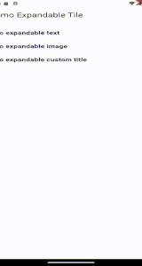

### ☕ Buy Me a Coffee

[](https://buymeacoffee.com/bimki)

# 🔽 Expandable Tile (Flutter)

A Flutter package that helps you expand or collapse widgets to show/hide content with customizable animations. It supports both horizontal and vertical directions and allows flexible customization to fit different UI needs.

---

## 🎬 Demo Video
| Text Title Demo            | Image Title Demo            | Custom Title Demo                  |
|----------------------------|-----------------------------|------------------------------------|
|   |   |   |
---

## 📱 Use Cases

- Expandable sections in forms or FAQs.
- Slide-in side menus or horizontal drawers.
- Toggle content areas with smooth transitions.
- Build custom accordion or collapsible lists.

---

## ✨ Features

- Show/hide widgets with various animation styles.
- Supports **vertical** and **horizontal** expansion.
- Support some animation types.
- Support change color, style title
- Change width title or use fit width base on length title
- Easily **customizable** animation types.
- Clean API for integration in different widget trees.
- Lightweight and fast.

---

## 🏗️ Architecture & Technologies


| Component             | Description                                                     |
|-----------------------|-----------------------------------------------------------------|
| `ExpandableTileView`  | Main widget to expand/collapse content with animation           |
| `ExpandableAnimation` | Enum to select animation type (e.g., size, fade, scale, def)    |
| `AxisExpand`          | Enum to control direction of expansion (horizontal or vertical) |
| `ExpandTileController`| Main controller to control state of expand (isExpand,axis,...)  |

---

## 🧾 Constructor Parameters

| Field             | Type         | Default               | Description                                                                   |
|-------------------|--------------|-----------------------|-------------------------------------------------------------------------------|
| `title`*(title)*  | `String`     | **required**          | The string displayed as the expandable title's widget.                        |
| `src`*(image)*    | `String`     | **required**          | The link to your image (asset, local file, online image)                      |
| `title`*(custom)* | `Widget`     | **required**          | The widget displayed as the expandable tile's title.                          |
| `child`           | `Widget`     | **required**          | The content widget shown when expanded.                                       |
| `width`*(title)*  | `double?`    | `null`                | The width of the entire tile. If null, it adapts to the content.              |
| `ratio`*(custom)* | `Ratio?`     | `Ratio(5, 5)`         | the ratio of left and right widgets when posHorizontal is true.               |
| `axis`            | `AxisExpand` | `AxisExpand.vertical` | The direction of expansion: vertical or horizontal.                           |
| `titleBGColor`    | `Color?`     | `null`                | Background color for the title section.                                       |
| `titleTextStyle`  | `TextStyle?` | `null`                | Text style for the title (if it's a `Text` widget).                           |
| `widthFill`       | `bool`       | `true`                | If true, the total width of the ExpandableTile will fit title and child       |
| `posHorizontal`   | `bool`       | `false`               | Applies only if `axis` is horizontal. If true, title on left, child on right. |
| `showIcon`        | `bool`       | `true`                | If false, the expandable title show without icon dropdown                     |
| `posHorizontal`   | `bool`       | `false`               | Applies only if `axis` is horizontal. If true, title on left, child on right. |
---

## 🚀 Usage

### ✅ Basic Usage

#### 📏 Default Size Animation

##### Child Horizontally (Size animation)

```dart
ExpandableTileView.animatedDef(
  title: "Animation default horizontal",
  axis: AxisExpand.horizontal,
  posHorizontal: true,
  child: Text("This is demo for expand text vertical. The Child is Text."),
)
```

##### Child Vertically (Size animation)

##### Title Text

```dart
ExpandableTileView.animatedDef(
  title: "Animation default horizontal",
  axis: AxisExpand.horizontal,
  child: Text("This is demo for expand text vertical. The Child is Text."),
)
```

##### Title Image

```dart
ExpandableImageView.animatedDef(
  src: "https://www.centrale-canine.fr/sites/default/files/2024-11/Fiche%20de%20race%20banni%C3%A8re%20corgi%20pembroke.jpg",
  child: Text("This is demo for expand image with default animation. The Child is Text"),
)
```

##### Title Custom

```dart
ExpandableCustomView.animatedDef(
    title: const Row(
        mainAxisAlignment: MainAxisAlignment.spaceBetween,
        children: [
            Text("Custom Title", style: TextStyle(fontSize: 14, color: Colors.redAccent),),
            Text("Default animation", style: TextStyle(fontSize: 14, color: Colors.green),),
            Icon(Icons.check, size: 27, color: Colors.redAccent),
        ],
    )
  child: Text("This is demo for expand custom with fade animation. The Child is Text"),
)
```

#### 🌫️ Fade Animation

##### Title Text

```dart
ExpandableTileView.animatedFade(
  title: "Animation fade",
  child: Text("Fading in and out!"),
)
```

##### Title Image

```dart
ExpandableImageView.animatedFade(
  src: "https://file.hstatic.net/1000292100/article/61312315_440746569804333_4727353524977926144_n_9a585e47ace64345af4b2dd9bc1f45bb.jpg",
  child: Text("This is demo for expand image with fade animation. The Child is Text"),
)
```

##### Title Custom

```dart
  ExpandableCustomView.animatedFade(
     title: const Row(
      mainAxisAlignment: MainAxisAlignment.spaceBetween,
      children: [
        Text("Custom Title", style: TextStyle(fontSize: 14, color: Colors.redAccent),),
        Text("Fade animation", style: TextStyle(fontSize: 14, color: Colors.green),),
        Icon(Icons.check, size: 27, color: Colors.redAccent),
      ],
    ) ,
    posHorizontal: true,  
    ratio: const Ratio(7,3),  
    child: Text("This is demo for expand custom with fade animation. The Child is Text"),
  )
```

#### 🔍 Scale Animation

##### Title Text

```dart
ExpandableTileView.animatedScale(
  title: "Animation scale",
  child: Text("Scaling animation!"),
)
```

##### Title Image

```dart
ExpandableImageView.animatedScale(
  src: "https://file.hstatic.net/1000292100/file/img_1907_grande_e05accd5a03247069db4f3169cfb8b11_grande.jpg",
  child: Text("This is demo for expand image with scale animation. The Child is Text"),
)
```

##### Title Custom

```dart
  ExpandableCustomView.animatedScale(
      title: const Row(
          mainAxisAlignment: MainAxisAlignment.spaceBetween,
          children: [
          Text("Custom Title", style: TextStyle(fontSize: 14, color: Colors.redAccent),),
          Text("Scale animation", style: TextStyle(fontSize: 14, color: Colors.green),),
          Icon(Icons.check, size: 27, color: Colors.redAccent),
      ],
  ),
  child: Text("This is demo for expand custom with scale animation. The Child is Text"),
)
```

#### None Animation

```dart
ExpandableTileView.noneAnimation(
  title: "No animation",
  child: Text("Scaling animation!"),
)
```

---

## ⚙️ Setup

To install the `expandable_tile` package, add the following to your `pubspec.yaml` file:

```yaml
dependencies:
  expandable_tile: ^1.0.2
```
## 📦 Supported SDKs

- **Flutter**: Stable channel
- **Android**: SDK 21+
- **iOS**: iOS 9+

---

## 🙌 Contributions

Feel free to open issues or pull requests on [GitHub](https://github.com/BimKi1604/expandable_tile).

---

## 📄 License

MIT License. See [LICENSE](LICENSE) for details.
