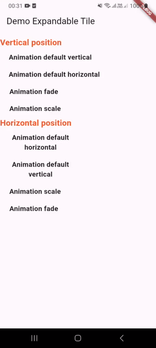

### ☕ Buy Me a Coffee

[](https://buymeacoffee.com/bimki)

# 🌱 Expandable Tile (Flutter)

A Flutter package that helps you expand or collapse widgets to show/hide content with customizable animations. It supports both horizontal and vertical directions and allows flexible customization to fit different UI needs.

---

## 🎬 Demo Video


## ✨ Features

- Show/hide widgets with various animation styles.
- Supports **vertical** and **horizontal** expansion.
- Support some animation types.
- Support change color, style title
- Change width title or use fit width base on length title
- Easily **customizable** animation types.
- Clean API for integration in different widget trees.
- Lightweight and fast.

---

## 🏗️ Architecture & Technologies


| Component             | Description                                                     |
|-----------------------|-----------------------------------------------------------------|
| `ExpandableTileView`  | Main widget to expand/collapse content with animation           |
| `ExpandableAnimation` | Enum to select animation type (e.g., size, fade, scale, def)    |
| `AxisExpand`          | Enum to control direction of expansion (horizontal or vertical) |
| `ExpandTileController`| Main controller to control state of expand (isExpand,axis,...)  |

---

## ⚙️ Setup

To install the `expandable_tile` package, add the following to your `pubspec.yaml` file:

```yaml
dependencies:
  expandable_tile: ^1.0.0
